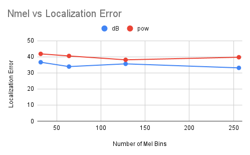
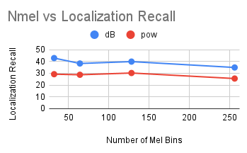
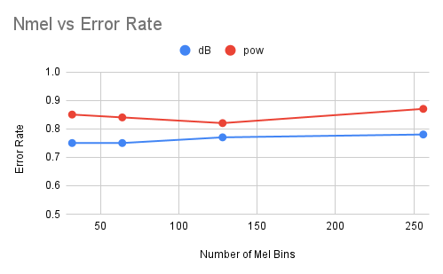
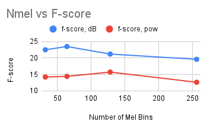
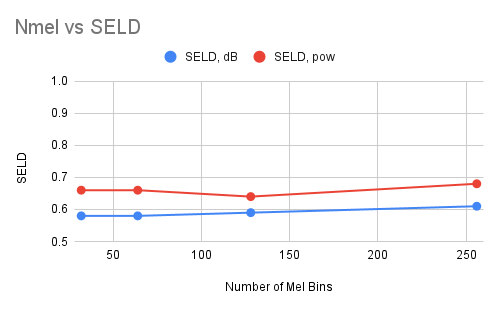
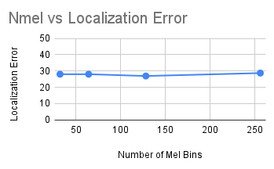
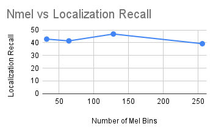
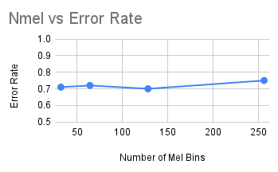
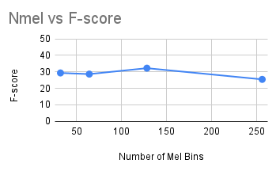
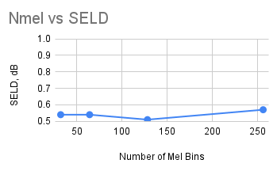

<head>
     <link rel="preconnect" href="https://fonts.googleapis.com">
     <link rel="preconnect" href="https://fonts.gstatic.com" crossorigin>
     <link href="https://fonts.googleapis.com/css2?family=Bebas+Neue&display=swap" rel="stylesheet">

</head>

<h1>Welcome</h1>

## About Me
My name is Aliaa Mahgoub. I am a junior at Brooklyn Technical High School.

## Projects

### Sound Scene Classification

Coming soon!

### Sound Event Localization and Detection

#### Experiment: Number of Mel bins for the Mel spectrogram

##### mic:

###### Class-aware localization scores

###### Localization-aware detection scores

###### SELD score

##### foa:

###### Class-aware localization scores

###### Localization-aware detection scores

###### SELD score

## Contact me
GitHub: [AliaaMahgoub](https://github.com/AliaaMahgoub)   
Email: aliaamahgoub0@gmail.com   
LinkedIn: [Aliaa Mahgoub](https://www.linkedin.com/in/aliaa-mahgoub-a1569b192)

