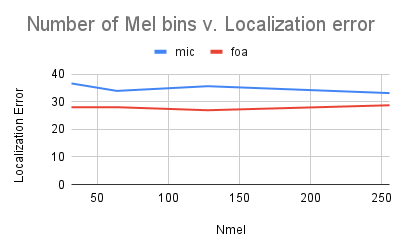
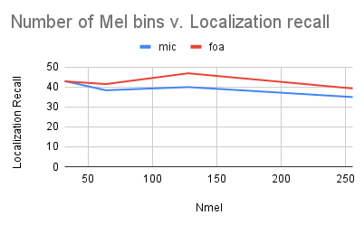
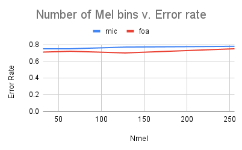
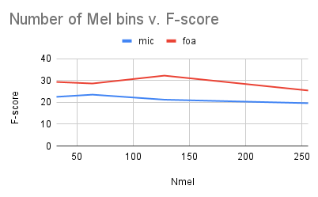

<head>
     <link rel="preconnect" href="https://fonts.googleapis.com">
     <link rel="preconnect" href="https://fonts.gstatic.com" crossorigin>
     <link href="https://fonts.googleapis.com/css2?family=Bebas+Neue&display=swap" rel="stylesheet">

</head>

<h1>Welcome</h1>

## About Me
My name is Aliaa Mahgoub. I am a junior at Brooklyn Technical High School.

## Projects
### Sound Scene Classification

Coming soon!

### Sound Event Localization and Detection
#### Experiment: Number of Mel bins for the Mel spectrogram

I experimented with the number of mel bins in the mel spectrogram to see how it affects the different evaluation metrics using both the microphone array (MIC) and first-order Ambisonics (FOA) formats. The original number of mel bins used in the model is 64.

##### Class-aware localization scores

##### Localization-aware detection scores

##### Analysis
As expected, the FOA data resulted in better scores overall. However, the FOA and MIC formats had different optimal nmel numbers. The MIC data performed best overall with 256 Mel bins, while the FOA data performed best with 128 Mel bins. 

## Contact me
GitHub: [AliaaMahgoub](https://github.com/AliaaMahgoub)   
Email: aliaamahgoub0@gmail.com   
LinkedIn: [Aliaa Mahgoub](https://www.linkedin.com/in/aliaa-mahgoub-a1569b192)

